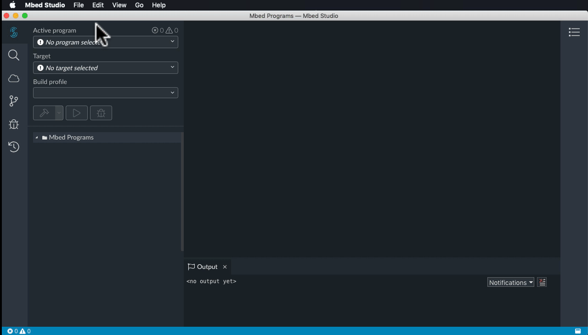
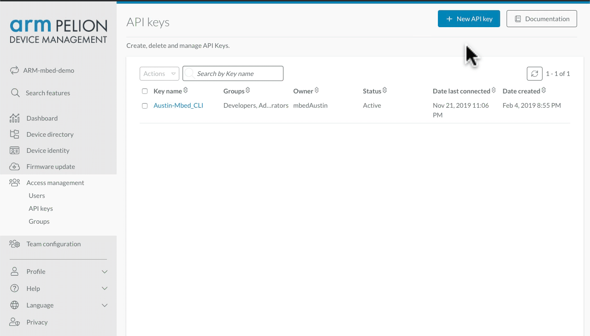
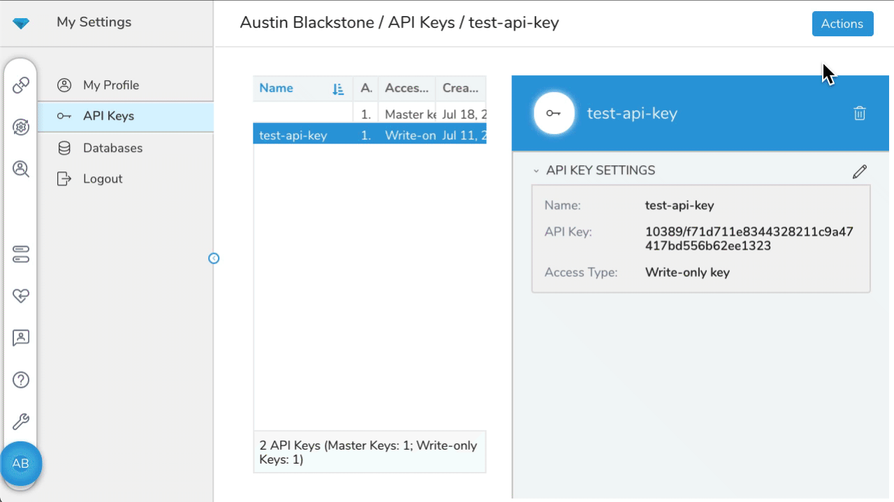
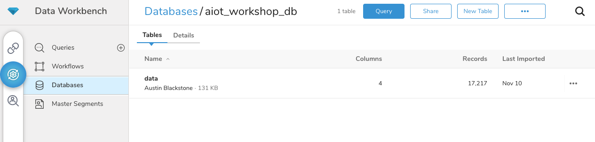
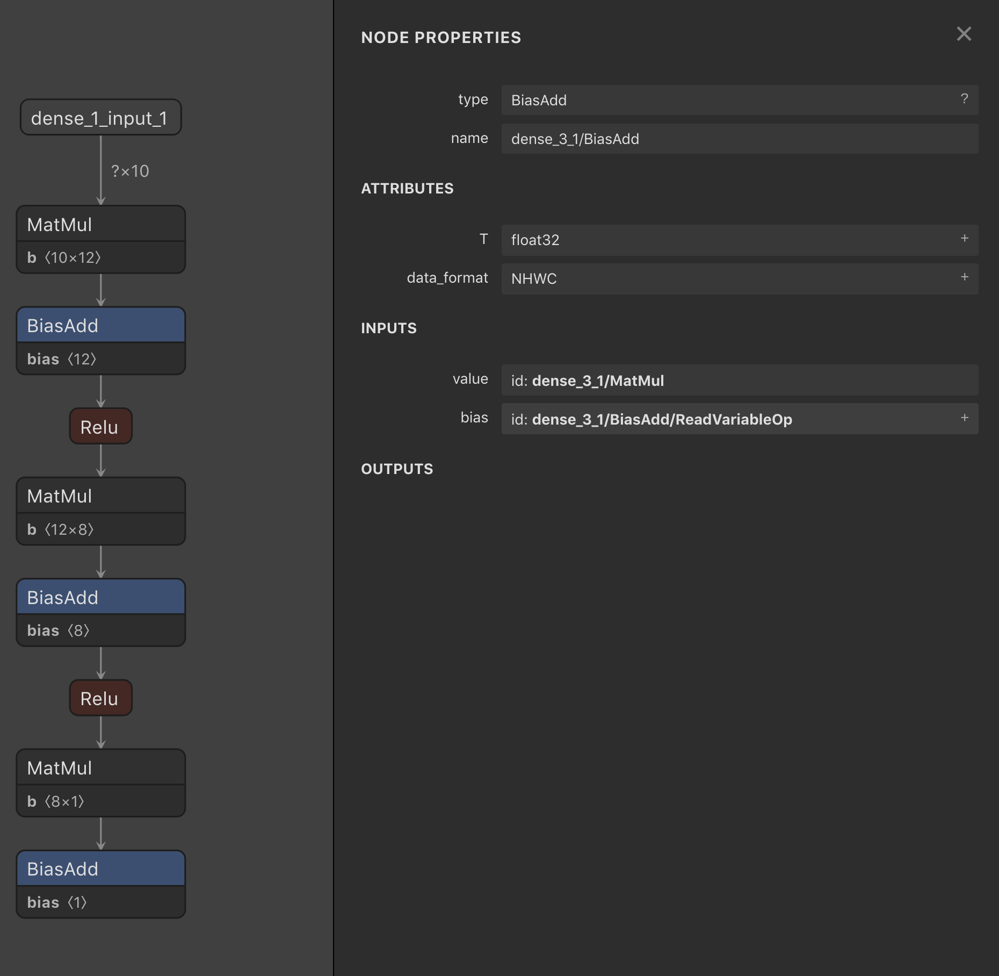

# Arm AIoT Developer Summit : Buidling End to End Machine Learning Workshop
This workshop covers how to do full lifecycle management of an IoT Edge device that uses machine learning and the Arm Pelion ecosystem. We will cover how to send data from your device running Mbed OS to the Arm Pelion Data Management service, how to then create a model in the cloud, and then deploy that model back to the device. 

TODO: Insert architecture diagram

At the end of this workshop you will have a Cortex M IoT device running machine learning at the edge and using that model to determine what data to send to the cloud. 

## Pre-Requisites
1) [Create a Mbed Compiler account](https://os.mbed.com/account/login/?next=/)
1) [Login to a Pelion Dashboard](https://portal.mbedcloud.com/federated-login?issuer=https%3A%2F%2Faccount.mbed.com%2F&next=%2F)  account using Mbed Compiler Account from previous step
1) Install [Mbed Studio](https://os.mbed.com/studio/) on your machine
1) Give your email to your instructor to add you to the Arm Data Management account. 


## Section 1: Device to Cloud
In the first workshop session we will connect our device running Mbed OS to the Pelion Data Management service and the Pelion Device Management service. Pelion Data will allow us to store data and then process it later into a ML model, Pelion Device management will allow us to view real time data on the device as well as issue commands and firmware updates to the device. 


### Import and configure device code

#### Pelion Device Management
In Mbed Studio import [https://github.com/BlackstoneEngineering/aiot-workshop](https://github.com/BlackstoneEngineering/aiot-workshop) into your workspace. This process will take a couple of minutes to pull down all the libraries to your local workspace. 



*NOTE* You may need to open a terminal in the aiot-folder and run `mbed deploy` if the program fails to download or compile. 

Next you will need to get your Pelion Device Management API key from the Pelion Portal : [https://portal.mbedcloud.com/access/keys/list](https://portal.mbedcloud.com/access/keys/list). Click `New API Key` in the top right to create a key. You will need it for the next step. 




Next you will need to add Pelion Device Management certificates for both connectivity and update to your project. You can do this easily from the left hand nav bar. 

1) add Pelion Device Management API Key
1) Create new certificate, and apply it to your project
1) Apply Update Certificate


#### Pelion Data Management (Treasure Data)

Next we are going to add a Pelion Data Management (Treasure Data) [API key](https://console.treasuredata.com/app/mp/ak/) and a custom table name to `mbed_app.json`. This will allow the device to send data to treasure data and store it into the specified table. (Note, the database is hard coded in `main.cpp` for reasons that will become apparent later). Everyone needs a unique table name, so I reccomend using your last name, or your first_last name as the table name.

Grab TD API key from here : [https://console.treasuredata.com/app/mp/ak/](https://console.treasuredata.com/app/mp/ak/) 



and put it into the `api-key` field in `mbed_app.json`.

```json
"api-key":{
            "help":  "REST API Key for Treasure Data",
            "value": "\"CHANGE_ME\""
        },
"table-name":{
            "help":  "name of table in Treasure Data to send data to",
            "value": "\"CHANGE_ME\""
        }
```

#### Compile the code

Now that you have setup all the configuration parameters you can compile and load the code onto your board. Click on the `Build` and then the `run` icons in Mbed Studio. This may take a minute or two to compile, when the board is being programmed you will see the LED flash, this is a good sign, wait for it to stop flashing and then move on to check the serial output!


#### Check Serial Output
Mbed Studio has a handy Serial Terminal built right into it, you can simply go to `View->Serial Monitor` and you should be ablet o see the data coming out of your board. Click the blue button on the board to see direct output, or try clicking the black button to reset the board and watch it boot up! Make sure to change your baud rate to `115200` for this example!

Success looks like this: 

```
Mbed Bootloader
[DBG ] Active firmware up-to-date
booting...

 Application Version 2
Start Device Management Client
Starting developer flow
Connecting with interface: Ethernet
NSAPI_STATUS_CONNECTING
NSAPI_STATUS_GLOBAL_UP
IP: 192.168.1.250
Network initialized, registering...

Client registered
Endpoint Name: 016e56566fb0000000000001001d6d5e
Device Id: 016e56566fb0000000000001001d6d5e
temp:28.6875,humidity:45.2000,pressure:993.3853

```


#### View Data in Pelion Device Management
Once your board has connected you can view it in the [Pelion Dashboard](https://portal.mbedcloud.com/devices/list). Try clicking through the resources on your device to see the temperature, humidity, pressure, and button clicks in real time from the board!

#### Check Treasure Data Database

After 3-5 minutes you should be able to see your data in [Treasure Data](https://console.treasuredata.com/app/databases/2440539) under the 'Databases' tab. Note that for this workshop everyone will be using the `aiot_workshop_db` database and sending their data to seperate tables. 




#### Challenges

If you've completed everything so far then try out these challenges to push youself! 

1) add more sensor values, the board has several more sensors, try adding them both the Pelion Device Management as well as to Treasure Data. 
2) modify how fast you are sending values to TD, right now its every 10s, try adjusting that to save power!

### Compile ML Models based on Data

After you  have some data in your database (reccomended 1000+ samples) we can generate new ML models from the data. To do this we're going to use the Workflow feature of Arm Treasure Data. If you'd like details on how we're doing this we can deep dive on it with you offline. For now just know that we're using Tensorflow go process the data and then running the models through a quantization engine to reduce the models to .cpp and .hpp files that we can use on an embedded device. 

#### Run Workflow in Treasure Data

It will take some time to run the workflow (\~10min per table in the database, so it may be best to run the workflow overnight.) Once the workflow has been run you can find the generated files here : [http://aiotworkshop.s3-website-us-west-1.amazonaws.com/index.html](http://aiotworkshop.s3-website-us-west-1.amazonaws.com/index.html).


#### Download your models

From the [link](http://aiotworkshop.s3-website-us-west-1.amazonaws.com/index.html) you will need to download the `table_name.cpp / .hpp` and `table_name_weights.hpp`. 

If you're interested you can also download the .h5 and .pb files to explore the models using a model explorer. 

*NOTE* if you did not get your table working, or do not have enough time, you can use the `data` model files as it'll work just fine fo rthe next steps. 

#### Explore the model

Using [this model explorer](https://lutzroeder.github.io/netron/) you can view the phases in your model. Pay special attention to the output node, as we'll be using that name in out embedded code. 



#### Extra Info

In case you're intersted what we're doing is running a Query in TD that lists all the data in the table by time. The script looks like this: 

```SQL
Select time, temp from data
order time asc
```

Then we save that data and run `/models/train.py` and then `/models/convert_h5_to_pb.py`. If you want to do this you can open up the Query interface in Treasure Data and run the query above, then save the results as a CSV and run the python scripts locally on them. Finally you will need to run the following script on the `.pb` file

```
pip install tensorflow==1.13.1
pip install utensor_cgen
utensor-cli convert data.h5.pb --output-nodes=dense_3_1/BiasAdd
```

Note that we have to tell the generator which output node to use, in this case its `dense_3_1/BiasAdd`, which we can see from the model explorer above. (or you can run `utensor-cli show data.pb` to explore it more thuroughly)


### Run ML on Device


#### Change branch to add-machine-learning
Next up we're going to use those model files you downloaded on the device. First though we're going to switch branches to the 'add-machine-learning' branch. You can do this by clicking on the branch name on the bottom left of Mbed Studio and selecting `add-machine-learning`

You will then need to pull down the changes made to the code. To do this simply run `mbed deploy` in the terminal within the `aiot-workshop` folder, this will download the uTensor library files. (if you dont have mbed cli installed you may need to run `pip install mbed-cli` first)


#### Issue firmware update to device

Now that you have everything downloaded we will recompile and upload the firmware to the cloud to be distributed as a firmware update. To do this go to the cloud->Update tab and press `Publish to Pelion`, this will recompile the image and upload it as a manifest to the Pelion Portal.

Next we will go to the [Pelion Portal and issue and update](https://portal.mbedcloud.com/firmware/manifests/list). You will need to first create an Update Campaign that uses the manifest, and then run the campaign. You should see your device as an option, select it and then start the campaign. You can view the progress of the campaign in the serial termail window. It will take a minute or two for the device to update, but once it does your new image will be running on it. 

Congratulations, you just issues a Machine Learning model as a Firmware Update to a device remotely in the field! Using this method you can now continuously deploy new models to make devices smarter over time!


#### Using the model to predict things!

Great, so now we've got a ML model running on the device, but now what? Well, the answer is we use that model. This model in particular is being used to predict what the next temperature value will be based on the previous 10 values seen. In our simulated environment lets say that if we see more than a 10% deviation in predicted temperature that a fire is starting, so we should send an alert! You can see this in the C code. 

Please note that it will take \~10 samples for the model to start working correctly, this is because the model is designed to need 10 samples to make an accurate prediction. Notice how untill the 10th sample the predicted temperature is garbage. 


#### Challenges

Now that we've got a model running on the device its up to you to challenge yourself! We've provided the training files used in the cloud in the /models folder as `train.py` and `convert_h5_to_pb.py` Here are you challenges:

1) Modify the model to use a different value (humidity or pressure)
2) Modify the model to use more than a single vlaue at a time


